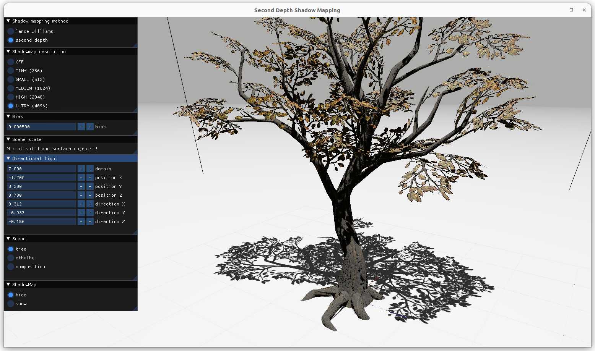

# SECOND\_DEPTH\_SHADOW\_MAPPING
Master project for the IG3D lesson held at the Sorbonne University. <br/>
This is a C++ implementation of the second depth shadow mapping technique introduced by Yulan WANG and Steven MOLNAR.
... [link_to_research_paper](http://www.cs.unc.edu/techreports/94-019.pdf) ...
<br/>
This shadow mapping method allows the programmer to stop relying on a bias parameter to avoid self shadowing.

### Dependencies

- [Conan](https://conan.io/)
- [Cmake](https://cmake.org/)

## Build

```
conan install . -s build_type=Release --build missing --install-folder=build
cmake -B build -S .
```
## Viewport navigation
- middle mouse button to look around
- SHIFT + middle mouse button to pan the view
- scroll to zoom in or out

## Screen capture
<br/>

<br/>

